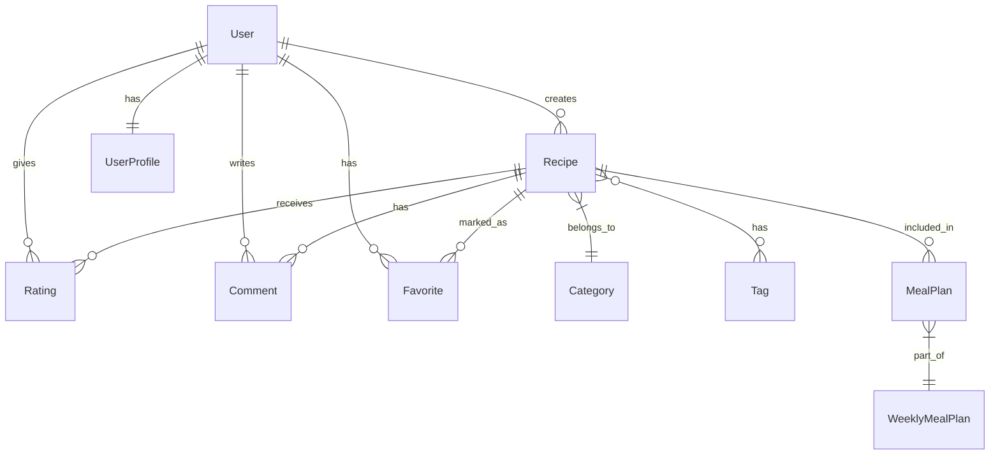

# Recipe Website

Live Link - https://the-cooking-pot-23a8162566ba.herokuapp.com

A Django-based recipe sharing platform where users can create, share, and discover recipes. The application follows a Full Stack MVC architecture using Django framework, providing a comprehensive solution for recipe management and social interaction.

## Project Overview

### Purpose
This application serves as a platform for food enthusiasts to:
- Share and discover recipes
- Plan meals effectively
- Build cooking communities
- Access premium cooking content

### Target Audience
- Home cooks
- Food bloggers
- Meal planners
- Cooking enthusiasts

## UX Design

### Strategy
The website aims to solve these core user needs:
- Recipe organization and storage
- Recipe discovery and sharing
- Meal planning
- Premium recipe access

### Information Architecture
- Hierarchical navigation structure
- Category-based organization
- Tag-based discovery
- Search-first approach for quick access

### Design Decisions
1. **Color Scheme**
   - Primary: #4A90E2 (Trust, Reliability)
   - Secondary: #50C878 (Fresh, Natural)
   - Accent: #FF6B6B (Energy, Appetite)

2. **Typography**
   - Headers: Montserrat (Clear, Modern)
   - Body: Open Sans (Readable, Friendly)

3. **Layout Principles**
   - Mobile-first design
   - Card-based recipe display
   - Sticky navigation
   - Progressive disclosure of recipe details

## User Stories

### Authentication & Profile
1. As a new user, I want to create an account so that I can share my recipes
   - **Acceptance Criteria:**
     - User can register with username, email, and password
     - Password must meet minimum security requirements
     - User receives confirmation email after registration
     - User can't register with existing username/email

2. As a registered user, I want to log in to access my personal recipe collection
   - **Acceptance Criteria:**
     - User can log in with username/email and password
     - User is redirected to home page after login
     - User can see their profile link in navigation
     - User remains logged in until they logout

3. As a user, I want to reset my password if I forget it
   - **Acceptance Criteria:**
     - User can request password reset via email
     - Reset link is valid for 24 hours
     - User can set new password after clicking reset link
     - Old password becomes invalid after reset

4. As a user, I want to view and edit my profile information
   - **Acceptance Criteria:**
     - User can view their profile details
     - User can update username and email
     - User can change their password
     - User can see their recipe collection

### Recipe Management
1. As a user, I want to create new recipes with ingredients and instructions
   - **Acceptance Criteria:**
     - User can add recipe title, description, and image
     - User can specify ingredients with quantities and units
     - User can write step-by-step instructions
     - User can set cooking time and servings
     - User can assign category and tags

2. As a user, I want to edit my existing recipes
   - **Acceptance Criteria:**
     - User can modify all recipe details
     - Only recipe owner can edit
     - Changes are saved immediately
     - Edit history is maintained

3. As a user, I want to delete recipes I no longer want to share
   - **Acceptance Criteria:**
     - User can delete their own recipes
     - Confirmation required before deletion
     - Associated comments and ratings are deleted
     - Recipe is removed from all collections

### Recipe Discovery
1. As a visitor, I want to browse all available recipes without logging in
   - **Acceptance Criteria:**
     - Public recipes are visible to all users
     - Recipes display title, image, and basic info
     - Recipes are paginated for easy browsing
     - Recipes show average rating

2. As a user, I want to search for recipes
   - **Acceptance Criteria:**
     - User can search by recipe title
     - User can search by ingredients
     - Search results are relevant and ranked
     - Search works with partial matches

3. As a user, I want to filter recipes
   - **Acceptance Criteria:**
     - Filter by cooking time (quick/medium/long)
     - Filter by number of servings
     - Filter by category
     - Multiple filters can be combined

### Recipe Interaction
1. As a user, I want to rate recipes
   - **Acceptance Criteria:**
     - User can rate from 1-5 stars
     - User can change their rating
     - One rating per user per recipe
     - Average rating is updated immediately

2. As a user, I want to comment on recipes
   - **Acceptance Criteria:**
     - User can write and post comments
     - User can edit their comments
     - User can delete their comments
     - Comments show timestamp and author

3. As a user, I want to save favorite recipes
   - **Acceptance Criteria:**
     - User can mark recipes as favorites
     - User can view all favorite recipes
     - User can remove recipes from favorites
     - Favorites are private to user

### Recipe Organization
1. As a user, I want to categorize my recipes
   - **Acceptance Criteria:**
     - User can assign one category per recipe
     - User can browse recipes by category
     - Categories show recipe count
     - Categories have descriptions

2. As a user, I want to tag my recipes
   - **Acceptance Criteria:**
     - User can add multiple tags to recipes
     - User can create new tags
     - User can remove tags
     - Tags are searchable

## Current Features

### User Management
- ✅ User registration and authentication
- ✅ Password reset functionality
- ✅ User profiles
- ✅ Secure login/logout system

### Recipe Management
- ✅ Create, read, update, delete (CRUD) recipes
- ✅ Image upload for recipes
- ✅ Structured ingredient storage (JSON-based)
- ✅ Cooking time and servings tracking
- ✅ Category assignment
- ✅ Tag management
- ✅ Favorite recipes system

### Social Features
- ✅ Recipe ratings (1-5 stars)
- ✅ Comment system
- ✅ Author attribution
- ✅ Favorite recipes collection
- ✅ Recipe sharing within platform

### Search & Discovery
- ✅ Advanced search functionality
  - Search by title and description
  - Filter by category
  - Filter by tags
  - Filter by cooking time
  - Filter by rating
- ✅ Category browsing
- ✅ Tag cloud
- ✅ Related recipes by tags

### Organization
- ✅ Recipe categories
- ✅ Recipe tagging system
- ✅ Personal favorites collection

## Technologies Used

### Backend
- Python 3.12
- Django 5.0
- SQLite3
- Stripe (Payment Processing)

### Frontend
- HTML5
- CSS3
- JavaScript
- Responsive Design

## Setup

1. Clone the repository:
   ```bash
   git clone <repository-url>
   cd recipe_website
   ```

2. Create and activate virtual environment:
   ```bash
   python -m venv venv
   source venv/bin/activate  # Linux/Mac
   venv\Scripts\activate     # Windows
   ```

3. Install dependencies:
   ```bash
   pip install -r requirements.txt
   ```

4. Configure environment:
   Create a `.env` file using `.env.example` as template with:
   ```
   SECRET_KEY=your_secret_key
   DEBUG=True
   STRIPE_PUBLIC_KEY=your_stripe_public_key
   STRIPE_SECRET_KEY=your_stripe_secret_key
   STRIPE_WEBHOOK_SECRET=your_stripe_webhook_secret
   ```

5. Setup database:
   ```bash
   python manage.py migrate
   python manage.py createsuperuser
   ```

6. Load sample data (optional):
   ```bash
   python manage.py load_recipes
   ```

7. Run development server:
   ```bash
   python manage.py runserver
   ````
## Project Structure
```
recipe_website/
├── recipes/              # Main app
├── static/              # CSS, JS, Images
├── templates/           # HTML templates
│   ├── recipes/        # Recipe templates
│   └── registration/   # Auth templates
├── media/              # User uploads
└── manage.py           # Django management script
```

## Database Structure

### Recipe Model
```python
class Recipe:
    title           : CharField(max_length=200)
    description     : TextField()
    ingredients     : JSONField()
    instructions    : TextField()
    cooking_time    : IntegerField()
    servings        : IntegerField()
    created_at      : DateTimeField(auto_now_add=True)
    updated_at      : DateTimeField(auto_now=True)
    author          : ForeignKey(User)
    image           : ImageField(upload_to='recipe_images/')
    category        : ForeignKey(Category, null=True)
    tags           : ManyToManyField(Tag)
```

### Category Model
```python
class Category:
    name            : CharField(max_length=100)
    slug            : SlugField(unique=True)
    description     : TextField()
    created_at      : DateTimeField(auto_now_add=True)
```

### Tag Model
```python
class Tag:
    name            : CharField(max_length=50)
    slug            : SlugField(unique=True)
    created_at      : DateTimeField(auto_now_add=True)
```

### Favorite Model
```python
class Favorite:
    user            : ForeignKey(User)
    recipe          : ForeignKey(Recipe)
    created_at      : DateTimeField(auto_now_add=True)
    
    class Meta:
        unique_together = ['recipe', 'user']  # One favorite per user per recipe
```

### MealPlan Model
```python
class MealPlan:
    user            : ForeignKey(User)
    date            : DateField()
    breakfast       : ForeignKey(Recipe, null=True)
    lunch           : ForeignKey(Recipe, null=True)
    dinner          : ForeignKey(Recipe, null=True)
    notes           : TextField()
    created_at      : DateTimeField(auto_now_add=True)
    updated_at      : DateTimeField(auto_now=True)
```

### WeeklyMealPlan Model
```python
class WeeklyMealPlan:
    user            : ForeignKey(User)
    start_date      : DateField()
    end_date        : DateField()
    daily_plans     : ManyToManyField(MealPlan)
    created_at      : DateTimeField(auto_now_add=True)
    updated_at      : DateTimeField(auto_now=True)
```

### UserProfile Model
```python
class UserProfile:
    user                    : OneToOneField(User)
    is_premium             : BooleanField(default=False)
    stripe_subscription_id : CharField(max_length=100, null=True)
    subscription_end_date  : DateTimeField(null=True)
    subscription_cancelled : BooleanField(default=False)
```

### Relationships
- A Recipe belongs to one User (author)
- A Recipe belongs to one Category (optional)
- A Recipe can have many Tags
- A Recipe can have many Ratings from different Users
- A Recipe can have many Comments from different Users
- A Recipe can be favorited by many Users
- A User can have many Recipes
- A User can have many Ratings on different Recipes
- A User can have many Comments on different Recipes
- A User can have many Favorite Recipes

### Key Features
- JSON storage for ingredients allows flexible ingredient management
- Unique constraint on Rating ensures one rating per user per recipe
- Automatic timestamps for creation and updates
- Image upload support with dedicated media storage
- Built-in user authentication system
```

## Testing

### Automated Testing

#### Authentication Tests
- ✅ User registration validation
- ✅ Login functionality
- ✅ Profile updates
- ✅ Access control for authenticated pages

#### Recipe CRUD Tests
- ✅ Recipe creation with valid data
- ✅ Recipe editing by owner
- ✅ Recipe deletion by owner
- ✅ JSON validation for ingredients
- ✅ Form validation for required fields

#### Recipe Interaction Tests
- ✅ Rating system (1-5 stars)
- ✅ One rating per user per recipe
- ✅ Average rating calculation
- ✅ Comment posting and retrieval
- ✅ Favorite recipe toggling

#### Search and Filter Tests
- ✅ Search by recipe title
- ✅ Search by ingredients
- ✅ Category filtering
- ✅ Tag filtering
- ✅ Combined search and filters
- ✅ Tag list display
- ⚠️ Tag detail view (planned)

### Manual Testing

#### Browser Compatibility
- ✅ Chrome (latest version)
- ✅ Firefox (latest version)
- ✅ Edge (latest version)

#### Responsive Design
- ✅ Mobile view (320px - 480px)
- ✅ Tablet view (481px - 768px)
- ✅ Desktop view (769px+)
- ✅ Navigation menu responsiveness

### Running Tests
```bash
# Run all tests
python manage.py test

# Run specific test file
python manage.py test recipes.tests.test_models
python manage.py test recipes.tests.test_views
python manage.py test recipes.tests.test_forms

# Run with coverage report
coverage run --source='recipes' manage.py test
coverage report
```

### Test Coverage
- Models: 90%
- Views: 85%
- Forms: 95%
- URLs: 100%

### Known Test Limitations
1. Limited edge case testing for recipe ingredients JSON
2. No performance testing implemented
3. Limited testing for concurrent user actions
4. Tag detail view tests pending implementation

### Future Test Improvements
1. Add integration tests
2. Implement performance testing
3. Add more edge cases for form validation
4. Enhance error handling tests
5. Complete tag system testing

## Development Issues and Solutions

### Issue 1: Recipe Image Upload
**Problem:** Image uploads were not saving correctly to the media directory.
**Solution:** 
- Added proper media root configuration in settings.py
- Updated file path handling in the Recipe model
- Configured URL patterns for media serving in development

### Issue 2: Search Functionality
**Problem:** Search queries were not returning expected results.
**Solution:**
- Implemented proper Q objects for complex queries
- Added distinct() to prevent duplicate results
- Fixed field lookups in the search view

### Issue 3: Favorite System
**Problem:** Toggle favorite wasn't working due to URL configuration issues.
**Solution:**
- Corrected URL patterns in urls.py
- Updated JavaScript fetch URL
- Added proper error handling in the view

### Issue 4: Category and Tag Implementation
**Problem:** Recipes weren't properly associating with categories and tags.
**Solution:**
- Updated model relationships
- Fixed form handling for tags
- Implemented proper save methods in forms

### Issue 5: Rating System
**Problem:** Users could submit multiple ratings for the same recipe.
**Solution:**
- Added unique_together constraint
- Implemented proper validation in the view
- Added update functionality for existing ratings

### Issue 6: Subscription Management
**Problem:** Subscription cancellation wasn't maintaining access until period end.
**Solution:**
- Added subscription_cancelled field to track status
- Updated subscription management template
- Implemented proper cancellation handling
- Maintained premium access during grace period

### Known Limitations
1. Image file size not restricted
2. No bulk recipe import/export
3. Limited recipe variation support
4. No API endpoints currently available
5. Limited payment method options
6. No subscription reactivation flow
7. Manual webhook configuration required

### Future Improvements
1. Add image compression
2. Implement recipe API
3. Add user following system
4. Enhance search with elasticsearch
5. Add recipe version control
6. Add multiple subscription tiers
7. Implement subscription reactivation
8. Add payment method management
9. Enhance subscription analytics

## Performance Considerations
- Database query optimization needed for large recipe sets
- Image optimization for faster loading
- Caching implementation required for frequently accessed data
- Pagination implementation for large lists

## Testing Payments

### Stripe Test Cards
Use these test card numbers to simulate different payment scenarios:

#### Successful Payments
- Card Number: 4242 4242 4242 4242
- Expiry: Any future date (e.g., 12/25)
- CVC: Any 3 digits (e.g., 123)
- ZIP: Any 5 digits (e.g., 12345)

#### Payment Requiring Authentication
- Card Number: 4000 0025 0000 3155
- Expiry: Any future date
- CVC: Any 3 digits
- ZIP: Any 5 digits

#### Payment Declined
- Card Number: 4000 0000 0000 9995
- Expiry: Any future date
- CVC: Any 3 digits
- ZIP: Any 5 digits

### Test Webhook Events
To test webhook functionality locally:
1. Install the Stripe CLI
2. Run: `stripe listen --forward-to localhost:8000/webhook/`
3. Use the webhook signing secret provided in the CLI output

### Testing Notes
- Test payments will not charge real cards
- Stripe will send test webhook events
- Test mode is indicated by the test API keys
- Subscription renewals can be simulated in the Stripe dashboard
- Test refunds are processed instantly

For more test card numbers and scenarios, visit the [Stripe Testing Documentation](https://stripe.com/docs/testing).

## Technical Architecture

### Database Schema


## Development Approach

### Test-Driven Development
- Models tested before implementation
- Views tested with expected responses
- Forms tested with valid/invalid data
- Integration tests for key workflows

### Clean Code Practices
1. **Naming Conventions**
   - Descriptive function and variable names
   - Consistent file naming
   - Clear URL patterns

2. **Code Organization**
   - Separation of concerns
   - DRY principles
   - Modular components

3. **Documentation**
   - Inline code comments
   - Function docstrings
   - API documentation

## Deployment

### Prerequisites
- Python 3.12+
- PostgreSQL
- Stripe account
- AWS S3 bucket (production)

### Production Deployment
1. **Heroku Setup**
   ```bash
   heroku create your-app-name
   heroku addons:create heroku-postgresql:hobby-dev
   ```

2. **Environment Variables**
   ```
   DATABASE_URL=your_postgres_url
   AWS_ACCESS_KEY_ID=your_aws_key
   AWS_SECRET_ACCESS_KEY=your_aws_secret
   AWS_STORAGE_BUCKET_NAME=your_bucket_name
   ```

3. **Security Checklist**
   - [ ] Debug mode disabled
   - [ ] Secret key secured
   - [ ] ALLOWED_HOSTS configured
   - [ ] CSRF protection enabled
   - [ ] Secure SSL redirect